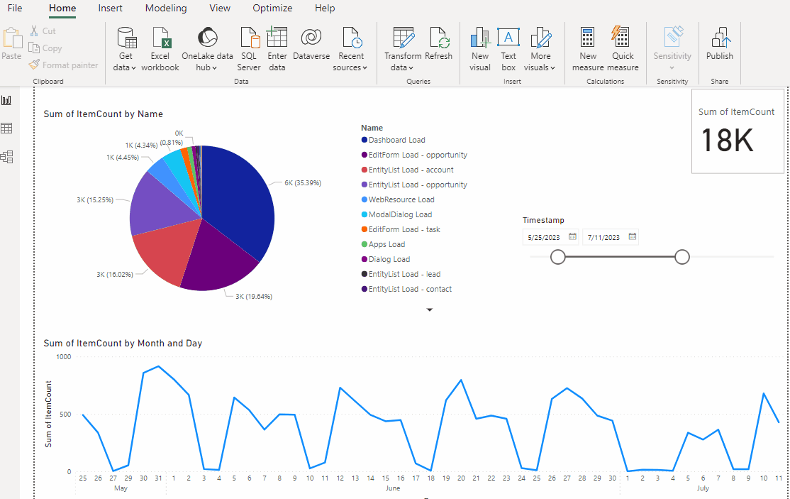
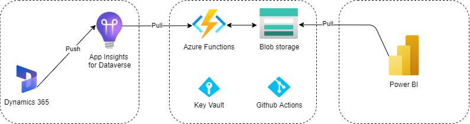

# dataverse-analytics

- [Summary](#summary)
- [Demo](#demo)
- [Technologies](#technologies)
- [Network](#network)

### Summary

**:pushpin: For a detailed walk through outlining all set up steps please see my blog post: [Collecting Dataverse Usage Analytics and Reporting with Power BI](https://tldr-dynamics.com/blog/dataverse-analytics)**

My goal was to create a 'Google Analytics-esque' dashboard based off Dynamics 365 pageView data. This pageView data is available once connecting Azure Application Insights to Dataverse/Dynamics 365.

We will create a scheduled function that will query our Application Insights instance daily and load CSVs into blob storage.

Power BI then transforms the data and provides the visualizations in order to make an interesting usage reporting tool.

### Demo

  

### Technologies

- Dynamics 365 / Dataverse
- .NET 6
- Azure
  - App Service
  - Functions
  - Key Vault
  - Application Insights
  - Blob Storage
- Power BI

### Network

  

